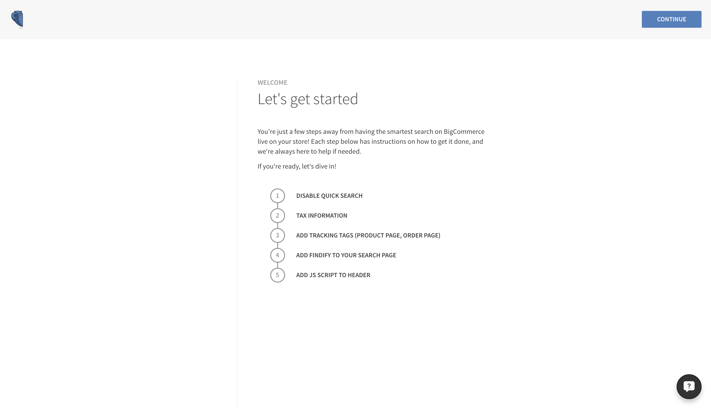
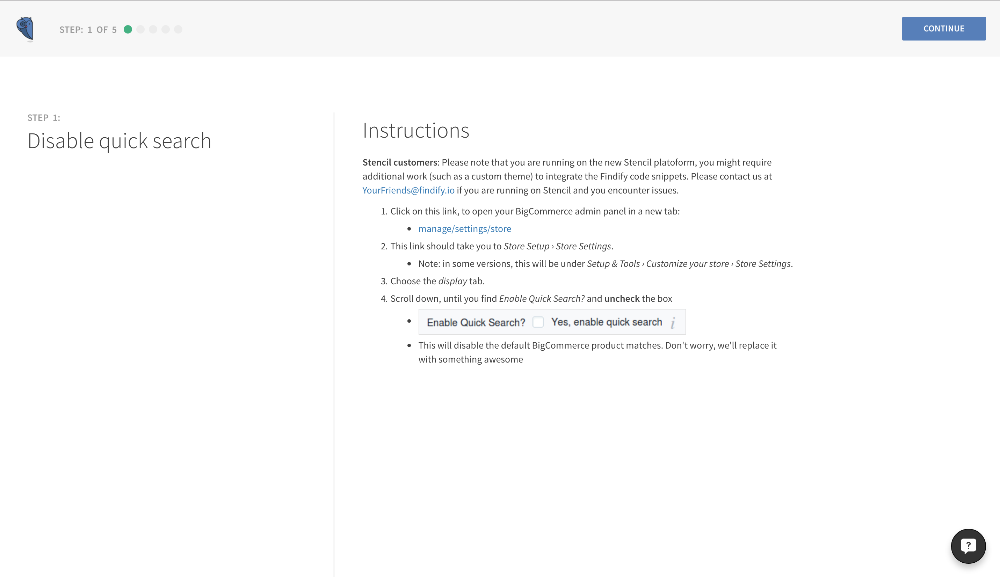
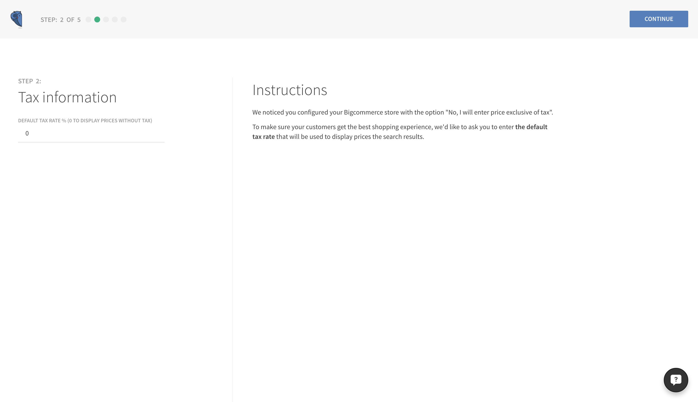
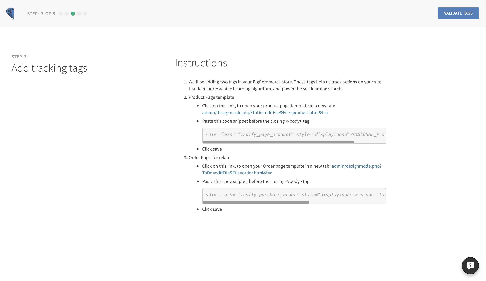
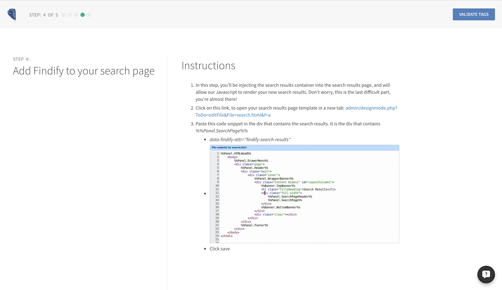
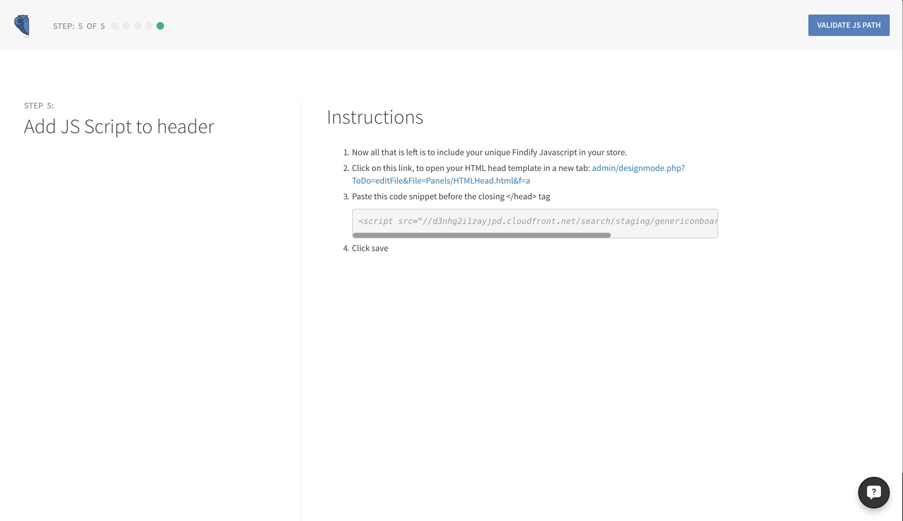

### Welcome


### Disable quick search


#### Links

* Store settings: __[store_url]/manage/settings/store__

### Tax information


### Add tracking tags


#### Links

* Product page: __[store_url]/admin/designmode.php?ToDo=editFile&File=product.html&f=a__
* Order page: __[store_url]/admin/designmode.php?ToDo=editFile&File=order.html&f=a__

#### Code snippets

* Product page
```html
<div class="findify_page_product" style="display:none">%%GLOBAL_ProductId%%</div>
```

* Order page
```html
<div class="findify_purchase_order" style="display:none">
   <span class="order_number">%%GLOBAL_OrderId%%</span>
</div>
```


### Add Findify to your search page


#### Links

* Search results page: __[store_url]/admin/designmode.php?ToDo=editFile&File=search.html&f=a__

#### Code snippets
```html
data-findify-attr="findify-search-results"
```

### Add JS Script to header


#### Links

* HTML head file: __[store_url]/admin/designmode.php?ToDo=editFile&File=search.html&f=a__

#### Code snippets

Code snippet can be found in your [Merchant Dashboard](https://dashboard.findify.io/#/dashboard/integration-details)
